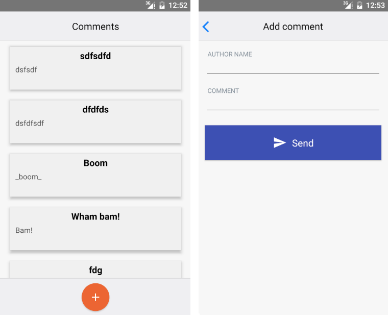
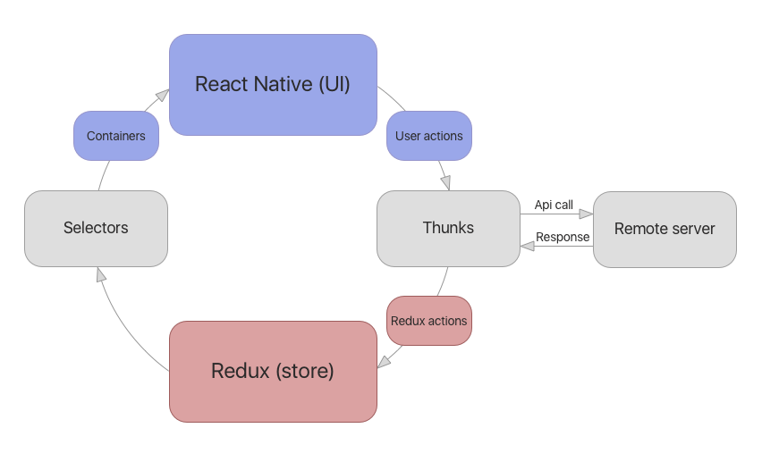

# Introduction

## App description

This is a tutorial for building a simple React Native app. 
In this app you can fetch comments made by other users from the remote api,
as well as post your own comments.

## Technology stack

- React Native
- Redux + Redux thunk
- Immutable.js
- Reselect
- Normalizr
- Jest

## Structure of the app

React native is a pure UI rendering framework. To add business logic to the app we use Redux
framework, which handles the job of updating application state and providing data to the UI.
The overall scheme of the app is provided below:

The app therefore is functioning in the circular way: 

1. It starts with an empty initial state (e.g. zero comments). 

2. On each state change, incl. initialization, redux triggers selectors. Selectors
could be thought of as a Model => ViewModel transformations.

3. Data from selectors comes into containers, thin react-redux components with a single
purpose of injecting data into React Native components as well as providing functions
for calling thunks in response to user interaction.

4. React Native components renders UI and waits for a user interaction. The first interaction
we do automatically - i.e. refresh the table to populate it with comments.
 
5. Thunk (a special function for handling async calls) starts fetching the data from the api.
After it receives response from the api it dispatches a series of redux actions to update
the redux state.

6. Redux state changes, provides data to selectors, which updates the UI via containers.
The app is waiting for further user interactions.

## Further reading

We deliberately picked libraries and approaches to make this tutorial a bootstrap
for scalable react native app. The details for each part of the app are given below:

- [Folders and structure](Structure.md)
- [Redux](Redux.md)
- [Selectors](Selectors.md)
- [Containers](Containers.md)
- [UI components](UI.md)
- [Thunks](Thunks.md)
- [Testing](Testing.md)
